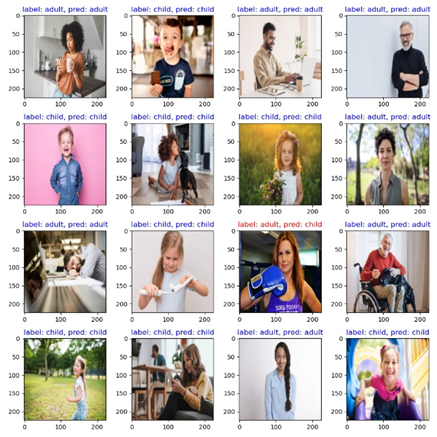

# Final Project
adult or child classification using pytorch
## train teacher model
run train.py
without pretrained model:
```bash
python train.py
```
with pretrained model:
```bash
python train.py --resume checkpoint/teacher.pth
```

## train student model
run train.py
without pretrained model:
```bash
python knowledge.py
```
with pretrained model:
```bash
python knowledge.py --resume checkpoint/student.pth
```
## show flops and params
run model.py
```bash
python model.py
```
## demo
run demo.py
```bash
python demo.py 
```

## result

